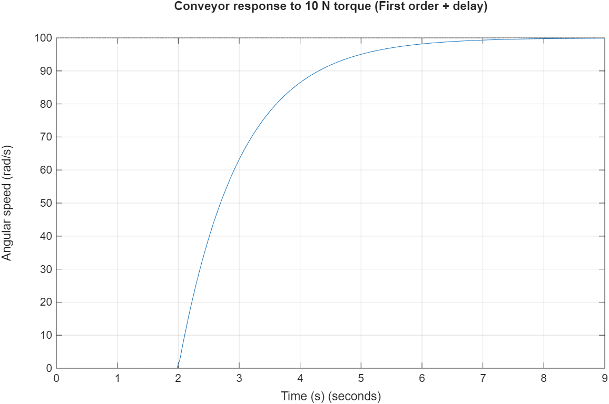
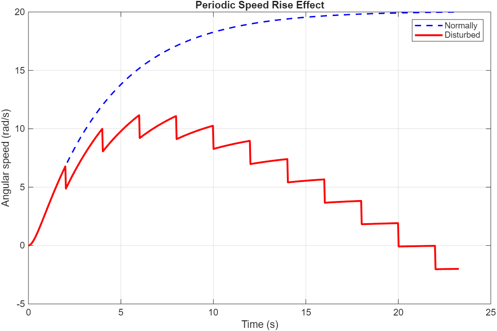
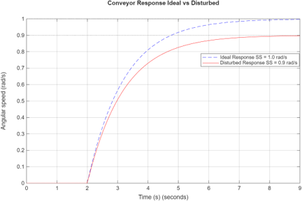
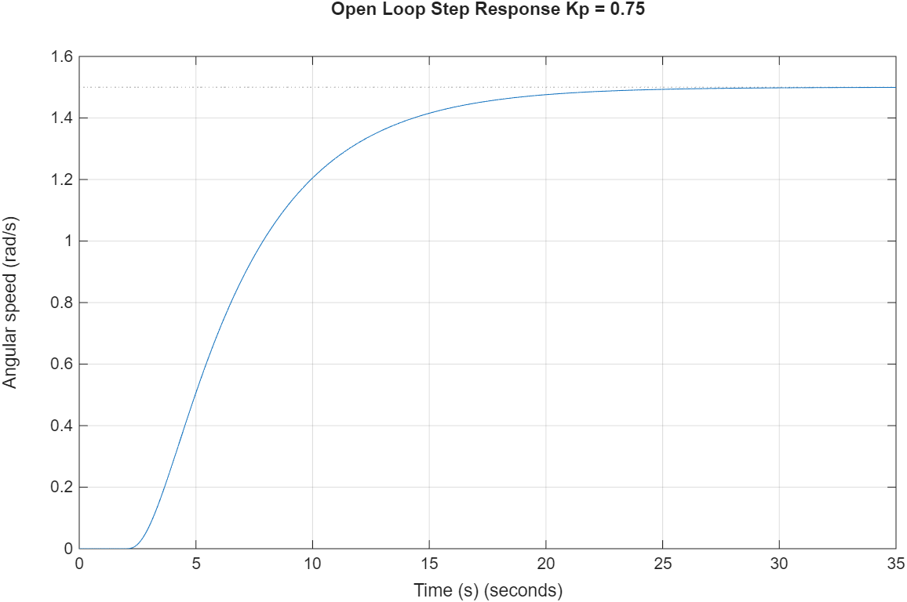

# DC Motor and Conveyor System Modeling and Control

## 📌 About the Project
This project involves the mathematical modeling, simulation, and open-loop control of a combined DC Motor and Conveyor system. Using MATLAB, the system's transient and steady-state behaviors are analyzed under various conditions, including time delays, internal parametric disturbances, and external periodic defects.

## 🧮 Mathematical Modeling
The system is divided into two main physical components, modeled via Laplace transforms:

* **DC Motor Model (Overdamped System):** 
  The motor's behavior is dominated by its mechanical parts (free decay after an impulse voltage).
  
  $$G_m(s) = \frac{0.15}{s^2 + 3.25s + 0.75}$$

* **Conveyor Model (First-Order with Time Delay):** 
  Modeled as a first-order system responding to a constant torque with a 2-second physical delay.
  
  $$G_c(s) = \frac{10 \cdot e^{-2s}}{s + 1}$$

## ⚠️ Disturbance Analysis
Real-world physical anomalies are mathematically integrated into the control loop:

1. **External Disturbance (Gear Defect):** 
   A mechanical defect causing a periodic speed drop of 2 rad/s every 2 seconds, modeled as an impulse train.
   
   $$d_o(t) = -2\sum_{k=1}^{\infty}\delta(t-2k) \implies d_o(s) = -2\left(\frac{e^{-2s}}{1-e^{-2s}}\right)$$

2. **Internal Disturbance (Roller Friction):** 
   A constant 1N torque loss on the conveyor system, acting as a step disturbance and creating a permanent steady-state error.
   
   $$d_i(t) = -1 \cdot h(t) \implies d_i(s) = -\frac{1}{s}$$

## ⚙️ Closed-Loop Architecture & Controller Design
The system's control architecture involves the plant, reference inputs, and both internal ($d_i$) and external ($d_o$) disturbances.

To achieve a target steady-state angular speed of 15 rad/s, a pure gain controller ($K_p = 0.75$) is calculated using the Final Value Theorem (FVT).

* **Open-Loop Transfer Function:**
  
  $$G_{OL}(s) = \frac{1.125 \cdot e^{-2s}}{(s^2 + 3.25s + 0.75)(s + 1)}$$

## 📊 Simulation Results

### 1. Subsystem Step & Impulse Responses
**DC Motor Response:**

**Conveyor Delay Response:**

### 2. Disturbance Effects
**Periodic Gear Defect:**

**Internal Roller Friction (Steady-State Error):**

### 3. Open-Loop System Performance
**Final Controlled Output ($15\text{ rad/s}$ Target):**

## 📂 Repository Contents
* `dc_motor_conveyor.m`: MATLAB scripts for component responses, disturbance simulations, and open-loop control.
* `Report 2.pdf`: Detailed engineering report containing mathematical derivations and complete system block diagrams.

## 🚀 How to Run
1. Clone this repository to your local machine.
2. Open `dc_motor_conveyor.m` in **MATLAB** (Control System Toolbox required).
3. Run the script to generate the dynamic control system plots.
